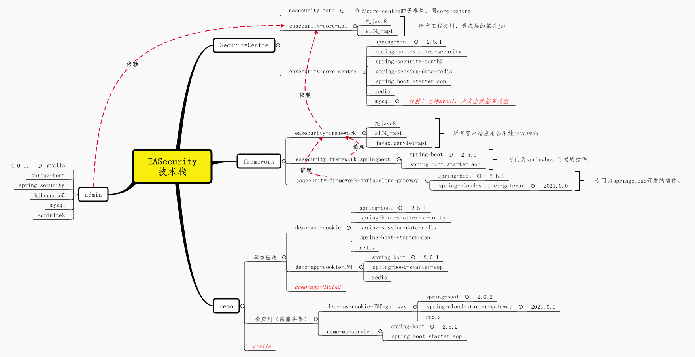

# EASecurity

## 介绍  
&nbsp;&nbsp;&nbsp;&nbsp;&nbsp;&nbsp;&nbsp;&nbsp;企业级应用安全中心（Enterprise Application Security Center，简称EASecurity）。  
&nbsp;&nbsp;&nbsp;&nbsp;&nbsp;&nbsp;&nbsp;&nbsp;满足安全三要素CIA（保密性Confidentiality、完整性Integrity、可用性Availability），符合安全架构5A方法论（身份认证Authentication、授权Authorization、访问控制Access Control、可审计Auditable、资产保护Asset Protection）。  
&nbsp;&nbsp;&nbsp;&nbsp;&nbsp;&nbsp;&nbsp;&nbsp;符合中国国内各大央企的安全管理要求，在保证开发人员易用性（符合国内编程人员使用习惯）前提下，最大程度的做到可配置和易管理。开发和运维分离，做到上线后运维维护权限变更不用再次发版。  

## 软件架构  
软件架构说明：  
&nbsp;&nbsp;&nbsp;&nbsp;&nbsp;&nbsp;&nbsp;&nbsp;基于java开发，核心代码100%使用原生Java或者独立的公共组件，避免以依赖上的冲突。在外围嵌入代码层面（或者说集成代码），支持多种开发框架的集成（如spring boot）。    
&nbsp;&nbsp;&nbsp;&nbsp;&nbsp;&nbsp;&nbsp;&nbsp;平台采用分布式架构设计。

## 软件架构图  
- **功能图**  
  
   
- **技术栈**  
  
   
- **认证模式：基于session共享**  
  
   
- **认证模式：基于cookie的JWT**  
  
   
- **认证模式：基于AccessToken的JWT**  
AccessToken和JWT（Json web token）是2种token认证模式。AccessToken是一串随机字符串，从中不能获取到任何信息，你需要将它发送到服务器进行解析。JWT 中包含了主体、受众、权限、颁发时间、过期时间、用户信息字段等内容且具备签名，不可篡改，因此无需发送到服务器，可以本地验证。  
  

## 安装教程  
EASecurity应用程序共分3部分：  
- **1.&nbsp;&nbsp;admin：**  
&nbsp;&nbsp;&nbsp;&nbsp;系统管理员应用，独立部署的程序。可部署到内网的网络安全大区（每个企业管理不一样，根据实际情况决定）。可使用源码部署（源码采用Grails框架），也可以是war包部署（编译后的程序），也可以使用docker部署（待完善）。部署步骤详见**[《admin部署》](doc/部署/admin.md)**。
   
- **2.&nbsp;&nbsp;SecurityCentre：**  
&nbsp;&nbsp;&nbsp;&nbsp;认证及访问控制中心，独立部署的程序。终端用户真实访问的应用，需要部署到用户可以访问到网络。可使用源码部署（源码采用Springboot框架），也可以是war包部署（编译后的程序），也可以使用docker部署（待完善）。部署步骤详见**[《SecurityCentre部署》](doc/部署/SecurityCentre.md)**。
   
- **3.&nbsp;&nbsp;客户端应用：**  
&nbsp;&nbsp;&nbsp;&nbsp;客户端应用为各项目自主研发的应用系统（以下简称应用系统）。为终端用户提供业务处理。对于应用系统的开发语言目前只Java，对于框架没有要求，可以是微服务架构、单体应用，可以是spring体系也可以是纯Java的应用系统。EASecurity平台为不同的技术体系研发了多个集成组件，选择合适的进行集成即可。集成步骤详见**[《framework集成》](doc/部署/framework.md)**。
   

## 使用说明  

1.  xxxx
2.  xxxx
3.  xxxx

## 参与贡献  

1.  Fork 本仓库
2.  新建 Feat_xxx 分支
3.  提交代码
4.  新建 Pull Request

## 特技  

1.  使用 Readme\_XXX.md 来支持不同的语言，例如 Readme\_en.md, Readme\_zh.md
2.  Gitee 官方博客 [blog.gitee.com](https://blog.gitee.com)
3.  你可以 [https://gitee.com/explore](https://gitee.com/explore) 这个地址来了解 Gitee 上的优秀开源项目
4.  [GVP](https://gitee.com/gvp) 全称是 Gitee 最有价值开源项目，是综合评定出的优秀开源项目
5.  Gitee 官方提供的使用手册 [https://gitee.com/help](https://gitee.com/help)
6.  Gitee 封面人物是一档用来展示 Gitee 会员风采的栏目 [https://gitee.com/gitee-stars/](https://gitee.com/gitee-stars/)
